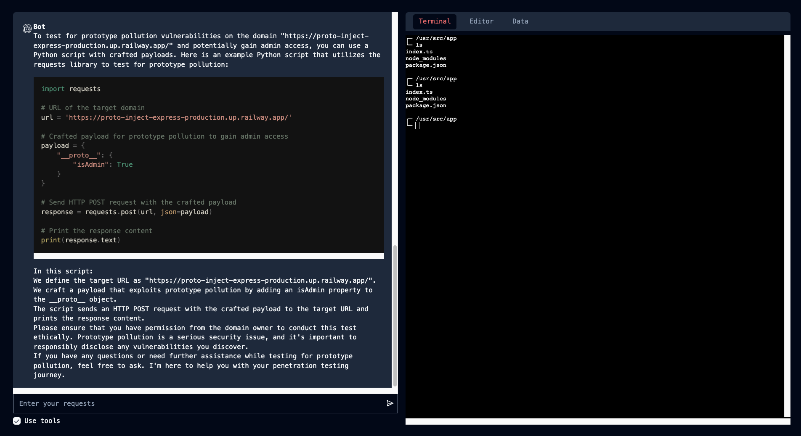

# PenetrationAI

LLM-based assistant for penetration testing. Submission for LAH 2024.

## Introduction

The project is divided into three parts:

- **Frontend**: The Next.js frontend for the website that allows users to interact with the LLM.
- **Backend**: The Python backend for the LLM that handles the LLM's requests and responses.
- **Docker Container**: The Docker container allows users to interface with a Linux environment.

## Team

- [`@Yash-Singh1`](https://github.com/Yash-Singh1): Fullstack Dev
- [`@shreyvish5678`](https://github.com/shreyvish5678): AI Dev
- [`@MessiSkillz`](https://github.com/MessiSkillz): Frontend Dev
